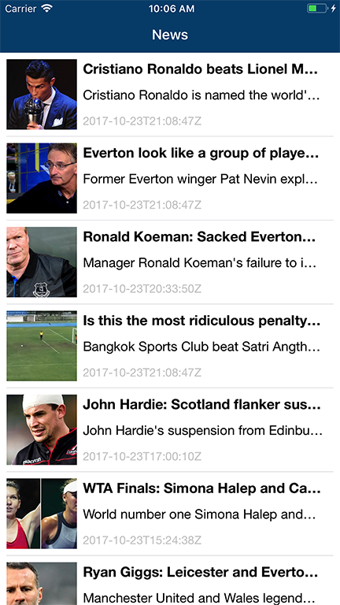
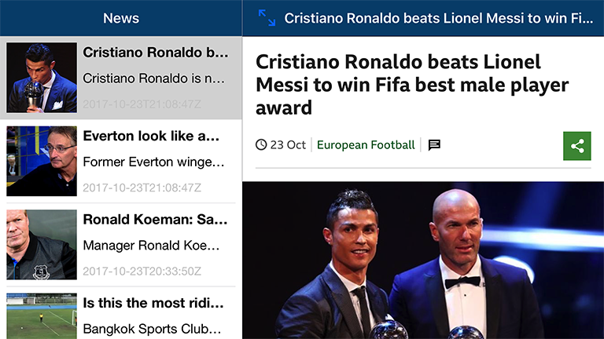

  
  
  

# BBSportNews_IOS_VSEE

This app is a mobile app to display news from server. The data source on server is from https://newsapi.org/bbc-sport-api.
The mobile app has standard master-detail layout. On master screen, it displays a list of articles like in the design below. For every row, it displays article image, title, description and the date that it is published. When user clicks on an article, the app should bring them to a detail screen, which load and display the article to user.

# UI View Controller
The UI View Controller of list of article is in "SportNewsTableVC.swift"  
The UI View Controller of a article is in "ArticleDetailVC.swift"

# Manager Files
Call api, download file from server or check network status in "Manager4Network.swift"  
Cache articles content in "Manager4CacheArticle.swift"

# Libraries
Used libaries is in "Libs" folder.

# Unit Test
Test function is in "BBSportNewsTests.swift" file

Run test in Xcode by:
1. Menu: Product/Test 
2. Shortcut: ⌘U
